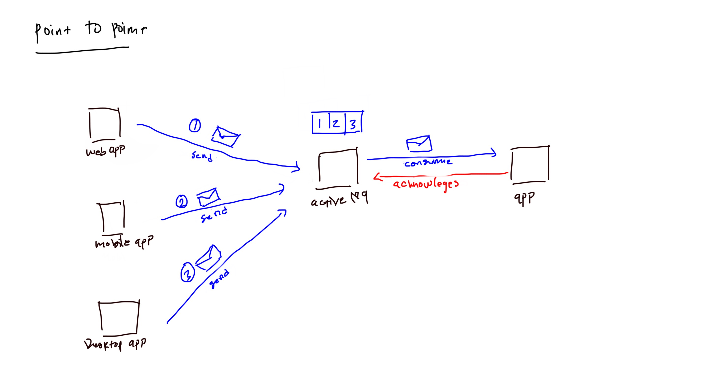

# Java Message Service with ActiveMQ

JMS atau Java Message Service, biasanya digunakan untuk mengirimkan pesan atau message minimal 2 atau lebih aplikasi. JMS berbeda dengan email.

## Istilah JMS

- JMS Provider, yaitu _Message Oriented Midleware_ atau aplikasi yang bertindak sebagai broker salah satu contohnya yaitu Apache ActiveMQ, RabitMQ, Hive MQTT, IBM MQ, JBoss Messaging dan lain-lain masih banyak lagi.
- JMS Client, yaitu aplikasi yang bertindak sebagai pengirim atau penerima pesan.
- JMS Producer / Publisher, yaitu aplikasi client atau JMS Client yang bertindak sebagai pengirim.
- JMS Consumer / Subscriber, yaitu aplikasi client atau JMS Client yang bertindak sebagai penerima.
- JMS Message, yaitu message atau data.
- JMS queue, yaitu message atau data yang dikirim yang harus dipastikan dibaca oleh client penerima.
- JMS topic, yaitu message atau data yang dikirim yang dapat diterima oleh lebih dari satu subscribe.

## Model Java Message Service

- Point To Point (queue)
- Publisher & Subscribe (topic)

### Model PTP (Point to Point)

Point to Point atau istilah lainnya peer to peer, Jadi dengan model ini messagenya hanya dapat diterima oleh satu consumer atau reciever.

## Daftar pustaka

- https://en.wikipedia.org/wiki/Java_Message_Service
- https://en.wikipedia.org/wiki/Message_queue
- https://docs.oracle.com/javaee/7/api/javax/jms/package-summary.html