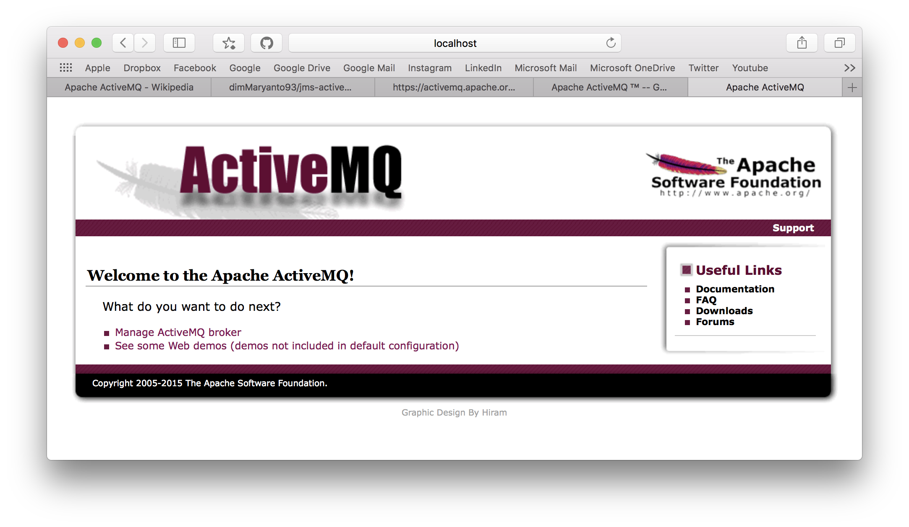

# Java Message Service with ActiveMQ

JMS atau Java Message Service, biasanya digunakan untuk mengirimkan pesan atau message minimal 2 atau lebih aplikasi. JMS berbeda dengan email.

## System Requirement

- Java
- Maven
- [Apache ActiveMQ](http://activemq.apache.org/download.html)

## Apache ActiveMQ getting started

How to run application:

- extract
- run

```bash
bin/activemq start
```

- launch [http://localhost:8161](http://localhost:8161)



## Istilah JMS

- Provider, yaitu _Message Oriented Midleware_ atau aplikasi yang bertindak sebagai broker salah satu contohnya yaitu Apache ActiveMQ, RabitMQ, Hive MQTT, IBM MQ, JBoss Messaging dan lain-lain masih banyak lagi.
- Client, yaitu aplikasi yang bertindak sebagai pengirim atau penerima pesan.
- Producer / Publisher, yaitu aplikasi client atau JMS Client yang bertindak sebagai pengirim.
- Consumer / Subscriber, yaitu aplikasi client atau JMS Client yang bertindak sebagai penerima.
- Message, yaitu message atau data.
- queue, yaitu message yang diterima oleh client **diantrikan** dan dikirim satu-per-satu.
- topic, yaitu message yang diterima oleh client **disebarkan** ke setiap client yang terkonek.

## Model Java Message Service

- Point To Point (queue)
- Publisher & Subscribe (topic)

### Model PTP (Point to Point)


Point to Point atau istilah lainnya peer to peer, Jadi dengan model ini messagenya hanya dapat diterima oleh satu consumer atau reciever.

## Message Queue

Message queue, dilewatkan melalui HTTP. ada beberapa protocol standar untuk menggunakan JMS yaitu 

- AMQP (Advanced Message Queuing Protocol), 
- STOMP (Streaming Text Oriented Messaging Protocol), dan 
- MQTT. 

## Referensi

- https://en.wikipedia.org/wiki/Java_Message_Service
- https://en.wikipedia.org/wiki/Message_queue
- https://docs.oracle.com/javaee/7/api/javax/jms/package-summary.html
- https://en.wikipedia.org/wiki/Message-oriented_middleware
- https://en.wikipedia.org/wiki/Advanced_Message_Queuing_Protocol
- https://en.wikipedia.org/wiki/Streaming_Text_Oriented_Messaging_Protocol
- https://en.wikipedia.org/wiki/MQTT
- https://en.wikipedia.org/wiki/Apache_ActiveMQ
